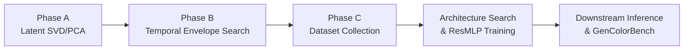

# Latent Color Subspace Control for FLUX.2

This directory contains the full implementation of the **training-free Latent Color Subspace Control** method adapted specifically for **FLUX.2** (`black-forest-labs/FLUX.2-dev`).

---

## 🔬 Core Methodology & Pipeline Overview



### Architectural Specifics: FLUX.2
| Property | Specification |
| :--- | :--- |
| **Latent Channels ($C$)** | 32 channels (packed 2x2 patches: $b \times \frac{h}{2} \cdot \frac{w}{2} \times 128$) |
| **VAE Compression** | $8\times$ spatial downsampling + $2\times2$ patch packing |
| **Scheduler** | Flow Matching (Euler) with dynamic shift |
| **Winning Schedule** | `gate_frac = 0.65`, `n_partes = 1`, `perfil = ascendente` |

---

## 📁 Repository Structure

- [`flux2_core.py`](file:///home/jsantamaria/projects/Color_Subspace/Flux2/flux2_core.py): Low-level core engine for FLUX.2 (model loader, 32-channel patch pack/unpacking, flow-matching scheduler hooks).
- [`inference.py`](file:///home/jsantamaria/projects/Color_Subspace/Flux2/inference.py): Standalone downstream targeted object color steering for arbitrary prompts.
- [`utils.py`](file:///home/jsantamaria/projects/Color_Subspace/Flux2/utils.py): SAM-3 instance segmentation, sRGB $\leftrightarrow$ CIELAB colorimetry, and exact CIEDE2000 metric.
- [`iscc_nbs.py`](file:///home/jsantamaria/projects/Color_Subspace/Flux2/iscc_nbs.py): ISCC-NBS Level 1 and Level 2 color dictionary.
- [`model_pca.py`](file:///home/jsantamaria/projects/Color_Subspace/Flux2/model_pca.py): 15D continuous color featurizer and `MLPShiftPCA` inference wrapper.
- [`fase_a_pca.py`](file:///home/jsantamaria/projects/Color_Subspace/Flux2/fase_a_pca.py): **Phase A**: Latent screening across 32 channels and PCA basis extraction.
- [`fase_b_config_pca.py`](file:///home/jsantamaria/projects/Color_Subspace/Flux2/fase_b_config_pca.py): **Phase B**: Temporal schedule $w(t)$ optimization across `gate_frac`, `n_partes`, and profile envelopes.
- [`coleccion_datos_mlp_pca.py`](file:///home/jsantamaria/projects/Color_Subspace/Flux2/coleccion_datos_mlp_pca.py): **Phase C Data Collection**: Multi-axial 3D spherical sampling in PCA space.
- [`train_and_search_mlp_pca.py`](file:///home/jsantamaria/projects/Color_Subspace/Flux2/train_and_search_mlp_pca.py): MLP architecture search and training.
- [`run_gencolorbench_pca.py`](file:///home/jsantamaria/projects/Color_Subspace/Flux2/run_gencolorbench_pca.py): Automated GenColorBench evaluation harness.

---

## 🚀 Standalone Inference Quickstart

Run closed-loop object color steering with an arbitrary prompt and target color:

```bash
python inference.py \
    --prompt "a photo of a ceramic mug on a wooden desk" \
    --target-color "#A52A2A" \
    --seed 42 \
    --out-dir ./inference_outputs
```
