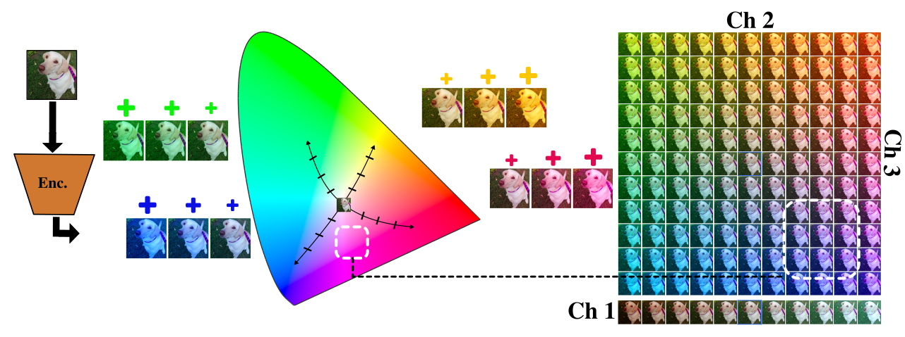

<div align="center">

# ON COLOR ALIGNMENT IN VAE LATENT SPACES AND ITS APPLICATIONS

[Julian D. Santamaria](https://julian075.github.io/)<sup>†1,2</sup> &nbsp;·&nbsp; [Kai Wang](https://wangkai930418.github.io/)<sup>3,4</sup> &nbsp;·&nbsp; [Jesús Malo](https://scholar.google.com/citations?user=0pgrklEAAAAJ&hl=en)<sup>5</sup> &nbsp;·&nbsp; [Javier Vazquez-Corral](https://jvazquezcorral.github.io/)<sup>1,2</sup> &nbsp;·&nbsp; [Alexandra Gomez-Villa](https://sites.google.com/view/alex-gomez-villa)<sup>1,2</sup>

<small>
<sup>1</sup> Computer Vision Center (CVC), Barcelona, Spain &nbsp;|&nbsp;
<sup>2</sup> Universitat Autònoma de Barcelona, Barcelona, Spain<br>
<sup>3</sup> City University of Hong Kong (Dongguan), China &nbsp;|&nbsp;
<sup>4</sup> City University of Hong Kong, China<br>
<sup>5</sup> Universitat de València, Spain &nbsp;|&nbsp;
<sup>†</sup> Corresponding author
</small>

<br>

[](https://julian075.github.io/Color_Subspace/)
[](https://arxiv.org/abs/placeholder)
[](LICENSE)

<br>



<p align="justify">
<em><b>Overview of Color Alignment and Applications.</b> Across diverse modern diffusion architectures (FLUX, FLUX.2, SD3, SD3.5, SDXL, PixArt, Z-Image), VAE latent representations inherently organize chromaticity along a low-dimensional, orthogonal color subspace. By characterizing these latent directions, our closed-loop steering framework enables precise numerical color control, multi-zone semantic color transfer from palettes or photographic references, and continuous spatially-adaptive gamut reduction directly at generation time.</em>
</p>

</div>

---

## 📖 Overview

Variational autoencoders (VAEs) are a key component of modern text-to-image diffusion models, generating images directly within their latent space. While VAEs are known to disentangle major factors of variation in natural image statistics—yielding one luminance axis and two opponent-color axes—the exact representation and controllability of color in these latent spaces has remained largely unexplored.

This work shows that across diverse modern text-to-image architectures (from SD1.5 and SDXL to FLUX.1/2, SD3/3.5, and Z-Image), VAEs share a low-dimensional **color subspace** aligned with perceptual brightness and opponent-colors. Through a linear approximation of the encoder and targeted latent sensitivity screening, we recover this orthogonal basis ($\mathbf{u}_1 \leftrightarrow L^\ast, \mathbf{u}_2 \leftrightarrow a^\ast, \mathbf{u}_3 \leftrightarrow b^\ast$). Leveraging this characterization, our training-free closed-loop steering framework enables three generation-time applications:

1. **ColorTuning (Numerical Color Precision)**: Steers object generation to follow exact numerical color specifications (HEX, RGB, CIELAB). By substituting numerical codes with ISCC-NBS Level 2 proxy names for prompt conditioning, predicting clean latents $\hat{z}_0$ at a calibrated gate step, and mapping residual errors through a lightweight ResMLP, ColorTuning achieves state-of-the-art accuracy on GenColorBench (CSS3/X11 and ISCC-L3).
2. **Saturation Control**: Continuously modulates the chroma of synthesized scenes or targeted objects without altering their semantic structure or hue. By scaling chroma $(1-\alpha)(a^\ast, b^\ast)$ while preserving lightness $L^\ast$, dense spatial latent displacements synthesize images within narrower color gamuts directly at generation time without post-processing.
3. **Color Transfer**: Matches target color distributions specified by discrete color palettes or exemplar reference images. Principal colors are extracted via CIELAB $k$-means clustering, prompt conditioning is initialized with the most chromatic color proxy, and semantic regions identified at the gate step are steered toward target palette colors via the latent color basis.

---

## 🛠️ Environment Setup

Create and activate a conda environment named `colortuning` with Python 3.10 and PyTorch 2.4+ (CUDA 12.4+ / 12.8):

```bash
# 1. Create and activate conda environment
conda create -n colortuning python=3.10 -y
conda activate colortuning

# 2. Install PyTorch with CUDA support (CUDA 12.4+ / 12.8)
pip install torch torchvision --index-url https://download.pytorch.org/whl/cu124

# 3. Install required dependencies
pip install -r requirements.txt
```

---

## 🏛️ Supported Models & Latent Steering Configurations

All models share a standardized pipeline while honoring their specific latent dimensions and scheduling characteristics:

| Architecture | Directory | Latent Channels | Gate Fraction | Schedule |
| :--- | :--- | :---: | :---: | :--- |
| **FLUX.1-dev** | [`Flux/`](Flux/) | 16 | 0.50 | Ascending |
| **FLUX.2-dev** | [`Flux2/`](Flux2/) | 32 | 0.65 | Ascending |
| **SD 3.0 Medium** | [`SD3/`](SD3/) | 16 | 0.75 | Triangular ($n=3$) |
| **SD 3.5 Medium** | [`sd3.5_m/`](sd3.5_m/) | 16 | 0.60 | Ascending |
| **SDXL 1.0** | [`SDXL/`](SDXL/) | 4 | 0.40 | Constant |
| **Z-Image** | [`z-image/`](z-image/) | 16 | 0.60 | Constant |

Each model directory contains:
* `fase_a_pca_out/pca_axes.json`: Discovered orthogonal color axes ($u_1, u_2, u_3$).
* `fase_b_pca_out/fase_b_winning_schedule.json`: Calibrated temporal envelope parameters.
* `mlp_training_out/mlp_shift_pca_best.pt`: Pre-trained residual MLP checkpoint.

---

## 🚀 Inference Quickstart: Three Application Modes

### Mode 1: ColorTuning (Numerical Color Precision)

Steers object generation towards exact numerical colors (HEX, RGB, CIELAB). The text prompt replaces numerical codes with an ISCC-NBS Level 2 color name proxy so the diffusion trajectory begins in the target color neighborhood. At the calibrated gate step, the clean latent $\hat{z}_0$ is predicted, segmented with SAM, and measured in CIELAB. A lightweight ResMLP predicts the displacement along the discovered color basis $(u_1, u_2, u_3)$, which is added inside the object mask with a linearly decaying schedule:

```bash
# Example with FLUX.1-dev using Hex code
python Flux/inference.py \
    --prompt "a photo of a ceramic mug on a table" \
    --target-color "#7B3F00" \
    --object "mug" \
    --device "cuda:0"

# Example with SDXL using RGB specification
python SDXL/inference.py \
    --prompt "a photo of an electric sports car parked in an urban street" \
    --target-color "rgb(180, 20, 45)" \
    --object "car" \
    --device "cuda:0"
```

---

### Mode 2: Color Transfer (Palettes & Reference Images)

Steers the scene's color distribution toward a discrete color palette (e.g., HEX values) or an exemplar reference image. When using an image, principal colors are extracted via $k$-means clustering in CIELAB with CIEDE2000 distance constraints. An ISCC-NBS Level 2 proxy initializes the trajectory in the appropriate chromatic basin, and semantic regions identified at the gate step are steered toward target palette colors via the latent color basis:

```bash
# Color transfer from a reference image or palette card
python color_transfer/flux_multizone_color_transfer.py \
    --prompt "a photo of an elegant vintage coupe car parked beside an architectural glass pavilion at dusk" \
    --ref-img "assets/reference_palette.png" \
    --main-obj "car" \
    --secondary-objs "pavilion" \
    --device "cuda:0" \
    --out-dir "outputs/color_transfer"
```

---

### Mode 3: Saturation Control

Continuously modulates scene or object chroma without altering semantic structure or hue. Text prompts proceed unconstrained until the gate step. At step $s$, predicted clean latent $\hat{z}_0$ is decoded to CIELAB $(L_i, a_i, b_i)$. For chroma reduction factor $\alpha \in [0, 1]$, lightness and hue angle are preserved while scaling chroma to $(L_i, (1-\alpha)a_i, (1-\alpha)b_i)$. The pretrained ResMLP evaluates dense spatial displacements across the grid to synthesize images within narrower color gamuts directly during generation:

```bash
# Continuously modulate scene saturation by 40%
python color_transfer/flux_spatial_gamut_reduction.py \
    --prompt "A colorful scarlet macaw parrot perched on a branch, vibrant plumage, jungle background" \
    --reduction 0.40 \
    --device "cuda:0" \
    --out-dir "outputs/saturation_control" \
    --prefix "macaw_red40"
```

---

## 📂 Repository Organization

```
Color_Subspace/
├── assets/                          # Teaser and documentation figures
│   └── teaser.png
├── img/                             # High-resolution paper figures & qualitative results
│   ├── latent_ch_mod/               # Latent channel perturbations (Fig. 2)
│   └── qualitative_results/         # Numerical color, transfer, and saturation figures
├── color_transfer/                  # Application engines
│   ├── flux_multizone_color_transfer.py
│   ├── flux_spatial_gamut_reduction.py
│   └── README.md
├── Flux/                            # FLUX.1-dev implementation & checkpoints
│   ├── flux_core.py                 # Pipeline wrappers & packing/unpacking
│   ├── inference.py                 # Numerical color generation inference
│   ├── model_pca.py                 # ResMLP architecture & loader
│   ├── utils.py                     # Colorimetry & SAM segmentation
│   ├── iscc_nbs.py                  # Color name dictionary
│   ├── fase_a_pca_out/              # Discovered PCA axes
│   ├── fase_b_pca_out/              # Winning schedule configuration
│   └── mlp_training_out/            # Best MLP checkpoint
├── Flux2/                           # FLUX.2-dev implementation & checkpoints
├── SD3/                             # Stable Diffusion 3 Medium implementation & checkpoints
├── sd3.5_m/                         # Stable Diffusion 3.5 Medium implementation & checkpoints
├── SDXL/                            # Stable Diffusion XL implementation & checkpoints
├── z-image/                         # Z-Image implementation & checkpoints
├── docs/                            # Project webpage
└── README.md
```

---

## 📜 Citation

If you find this work or codebase helpful in your research, please cite:

```bibtex
@article{santamaria2025coloralignment,
  title={On Color Alignment in VAE Latent Spaces and Its Applications},
  author={Santamaria, Julian D. and Wang, Kai and Malo, Jes{\'u}s and Vazquez-Corral, Javier and Gomez-Villa, Alexandra},
  journal={arXiv preprint arXiv:XXXX.XXXXX},
  year={2025}
}
```
