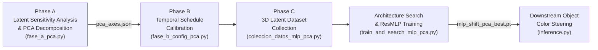

# Latent Color Subspace: Multi-Model Object Color Steering in Diffusion Latent Spaces

This repository contains the official codebase and pre-calibrated checkpoints for **Latent Color Subspace Control**, a training-free and model-agnostic framework that discovers interpretable orthogonal color coordinate systems within diffusion latent representations.

By combining the discovered principal latent color axes with lightweight regression MLPs (`MLPShiftPCA`) and temporally calibrated injection schedules, the framework enables closed-loop, single-forward-pass color steering of targeted objects directly during denoising.

---

## 🔬 Unified Pipeline Methodology

Every supported architecture follows the same 5-stage pipeline:



### Pipeline Phases Explained:
1. **Phase A: Latent Sensitivity Analysis & PCA Decomposition (`fase_a_pca.py`)**:
   Screening latent channels across color shifts, followed by SVD/PCA decomposition to identify the 3 orthogonal principal components $\mathbf{U}_1, \mathbf{U}_2, \mathbf{U}_3$ that maximally correlate with perceptual color dimensions ($L^*, a^*, b^*$). Saved in `fase_a_pca_out/pca_axes.json`.
2. **Phase B: Temporal Schedule Calibration (`fase_b_config_pca.py`)**:
   Grid search over gating fraction (`gate_frac`), envelope profile shape (`perfil_name`: plano, ascendente, triangular), and sub-step discretization (`n_partes`) to determine the optimal injection window where latents accept color manipulation without degrading spatial structure.
3. **Phase C: 3D Latent Dataset Collection (`coleccion_datos_mlp_pca.py`)**:
   Automated generation of paired training data: initial object color $(L^*_0, a^*_0, b^*_0)$ and target color $(L^*_t, a^*_t, b^*_t)$ mapped to shift magnitude vectors $(m_1, m_2, m_3)$ in PCA space.
4. **Phase D: Architecture Search & MLP Training (`train_and_search_mlp_pca.py`)**:
   Trains the lightweight `MLPShiftPCA` regression model to map colorimetry differences $(\Delta L^*, \Delta a^*, \Delta b^*)$ into optimal latent shift vectors. Saved in `mlp_training_out/mlp_shift_pca_best.pt`.
5. **Phase E: Downstream Single-Pass Inference (`inference.py`)**:
   In-flight closed-loop generation. At the gate step during denoising, the predicted clean image $\hat{x}_0$ is segmented once using SAM-3, its initial color is measured, the MLP predicts $(m_1, m_2, m_3)$, and the spatial perturbation is applied smoothly across the remaining denoising steps.

---

## 🏛️ Architectural Comparison Matrix

| Model Directory | Base Model ID | Latent Channels ($C$) | VAE Compression & Scaling | Scheduler | Optimal Schedule (`gate_frac`, profile) |
| :--- | :--- | :--- | :--- | :--- | :--- |
| **[`Flux/`](file:///home/jsantamaria/projects/Color_Subspace/Flux)** | `black-forest-labs/FLUX.1-dev` | 16 (2x2 packed $\to$ 64) | $8\times$, scale + shift | Flow Matching (Euler) | $0.50$, ascendente ($n=1$) |
| **[`Flux2/`](file:///home/jsantamaria/projects/Color_Subspace/Flux2)** | `black-forest-labs/FLUX.2-dev` | 32 (2x2 packed $\to$ 128) | $8\times$, scale + shift | Flow Matching (Euler) | $0.65$, ascendente ($n=1$) |
| **[`PixArt/`](file:///home/jsantamaria/projects/Color_Subspace/PixArt)** | `PixArt-alpha` & `PixArt-Sigma` | 4 | $8\times$, `scale = 0.18215` | DPM-Solver / Flow | $0.50$ (Alpha) / $0.75$ (Sigma), triangular ($n=3$) |
| **[`SD3/`](file:///home/jsantamaria/projects/Color_Subspace/SD3)** | `stabilityai/stable-diffusion-3-medium` | 16 | $8\times$, scale + shift | FlowMatchEuler ($v$-pred) | $0.75$, triangular ($n=3$) |
| **[`SDXL/`](file:///home/jsantamaria/projects/Color_Subspace/SDXL)** | `stabilityai/stable-diffusion-xl-base-1.0` | 4 | $8\times$, `scale = 0.13025` | EulerDiscrete ($\epsilon$-pred) | $0.40$, plano ($n=1$) |
| **[`sd3.5_m/`](file:///home/jsantamaria/projects/Color_Subspace/sd3.5_m)** | `stabilityai/stable-diffusion-3.5-medium` | 16 | $8\times$, `scale = 1.5305, shift = 0.0609` | FlowMatchEuler ($v$-pred) | $0.60$, ascendente ($n=1$) |
| **[`z-image/`](file:///home/jsantamaria/projects/Color_Subspace/z-image)** | `Tongyi-MAI/Z-Image` | 16 | $8\times$, scale + shift | Flow Matching (Euler) | $0.60$, plano ($n=1$) |

---

## 📁 Repository Structure

Each model subfolder adheres to a uniform structure containing only essential modules and pre-calibrated weights:

```
Color_Subspace/
├── .gitignore
├── README.md
├── Flux/
├── Flux2/
├── PixArt/
├── SD3/
├── SDXL/
├── sd3.5_m/
└── z-image/
```

Inside each architecture directory:
*   `<model>_core.py`: Core pipeline setup, latent packing/unpacking, and scheduler step hooks.
*   `inference.py`: Standalone single-prompt object color steering application.
*   `model_pca.py`: PyTorch module definition for `MLPShiftPCA` and checkpoint loader.
*   `utils.py`: Colorimetry (Hex $\leftrightarrow$ RGB $\leftrightarrow$ CIELAB $\leftrightarrow$ CIEDE2000) and SAM-3 segmentation hooks.
*   `iscc_nbs.py`: Standardized color taxonomy dictionary.
*   `fase_a_pca.py`: Phase A PCA axes extractor.
*   `fase_b_config_pca.py`: Phase B temporal schedule search.
*   `coleccion_datos_mlp_pca.py`: Phase C dataset collection harness.
*   `train_and_search_mlp_pca.py`: Phase D MLP architecture search and training.
*   `run_gencolorbench_pca.py`: GenColorBench standardized benchmark runner.
*   `fase_a_pca_out/pca_axes.json`: Computed principal color axes in latent space.
*   `mlp_training_out/mlp_shift_pca_best.pt`: Pre-trained MLP checkpoint (~0.1MB - 1.2MB).

---

## 🚀 Standalone Inference Quickstart

Every model includes a self-contained `inference.py` script that performs in-flight closed-loop object color steering. The inference engine is **format-agnostic** and **automatically infers** both the target object and target color directly from the prompt text, with optional CLI flag overrides.

### 🌟 Key Inference Capabilities:
- **Prompt-Only Execution (Zero-Config)**: Simply pass `--prompt`. The target object and color specification are dynamically extracted from the prompt text (supporting GenColorBench NCU formats and open natural language).
- **Format-Agnostic Color Parsing**: Accepts:
  - **Hex**: `#800000`, `800000`, `#FFF`, or typo-tolerant inputs like `#FFFF0`.
  - **RGB**: Strings (`"rgb(255, 0, 255)"`), tuples `(255, 0, 255)`, lists `[255, 0, 255]`, or normalized floats `[1.0, 0.0, 0.0]`.
  - **CIELAB**: Strings (`"lab(53.2, 79.2, -107.9)"`), dicts `{"lab": (53.2, 79.2, -107.9)}`, or raw tuples.
  - **Named colors**: CSS/X11 and ISCC names (`maroon`, `darkorange`, `cyan`, etc.).
- **Dynamic Object Extraction**: Open parser identifies target objects (`cat`, `parrot`, `suit`, `towel`, `wallet`, `ceramic mug`, etc.) directly from prompt phrasing without hardcoded word whitelists.
- **Semantic Text Prompt Adaptation**: Numerical color tokens are converted to natural color names for the diffusion text encoder (`"in the color #800000"` $\to$ `"colored maroon"`), while exact CIELAB numerical coordinates guide the latent steering.
- **Optional Overrides**: Passing `--target-color` or `--object` explicitly overrides automatic discovery.

---

### Usage Examples

#### 1. Auto-Discovery from Prompt (Single Argument)
```bash
# Hex color
python SDXL/inference.py --prompt "A photo of a cat in the color #800000"

# RGB color
python Flux/inference.py --prompt "A photo of a backpack in the color rgb(120, 200, 50)"

# Typo-tolerant hex
python sd3.5_m/inference.py --prompt "A photo of a suit in the color #FFFF0"
```

#### 2. Explicit Overrides
```bash
python SD3/inference.py \
    --prompt "a photo of a ceramic mug on a wooden desk" \
    --target-color "#FF8C00" \
    --object "mug" \
    --seed 42 \
    --out-dir ./inference_outputs
```

---

### CLI Arguments:
*   `--prompt`: Input text prompt (e.g., `"A photo of a parrot in the color #FF8C00"`).
*   `--target-color` / `--hex`: *(Optional)* Target color specification (Hex, RGB, CIELAB, or name). Auto-detected from prompt if omitted.
*   `--object`: *(Optional)* Target object to segment with SAM-3. Auto-detected from prompt if omitted.
*   `--seed`: Random seed for reproducibility (default: `42`).
*   `--device`: PyTorch device (default: `"cuda:0"` if available, else `"cpu"`).
*   `--steps`: Number of diffusion steps (model-specific default).
*   `--guidance`: Classifier-free guidance scale.
*   `--resolution`: Image resolution (default: `1024`).
*   `--out-dir`: Destination folder for generated images (default: `./inference_outputs`).
*   `--metrics`: Measure and print color accuracy metrics in the terminal ($\Delta E^*_{00}$, $\Delta E^*_{76}$, $\Delta C^*$, $|\Delta C^*|$, $\Delta h^\circ$, $|\Delta h^\circ|$, and $\Delta H^*_{ab}$) between the segmented object in the generated image and the target color.


