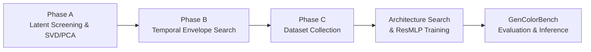

# Latent Color Subspace Control for Stable Diffusion XL (SDXL)

This directory contains the full implementation of the **training-free Latent Color Subspace Control** method adapted specifically for **Stable Diffusion XL** (`stabilityai/stable-diffusion-xl-base-1.0`).

---

## 🔬 Core Methodology & Pipeline Overview



### Architectural Specifics: SDXL vs. Other Architectures
| Component | FLUX.1 / FLUX.2 | SD 3.5 Medium | PixArt-Alpha/Sigma | Stable Diffusion XL (SDXL) |
| :--- | :--- | :--- | :--- | :--- |
| **Latent Channels ($C$)** | 16 / 32 | 16 | 4 | **4 channels** |
| **VAE Compression** | $8\times$ downsampling | $8\times$ downsampling | $8\times$ downsampling | **$8\times$ downsampling** ($1024\times 1024 \to 128\times 128$) |
| **VAE Scaling & Shift** | scale + shift | `scaling_factor = 1.5305`, `shift = 0.0609` | `scaling_factor = 0.18215` | **`scaling_factor = 0.13025`**, `shift = 0.0` |
| **Latent Representation** | 2x2 Patch Packed | Standard 4D $(B, 16, H, W)$ | Standard 4D $(B, 4, H, W)$ | **Standard 4D $(B, 4, H, W)$** |
| **Scheduler** | Flow Matching (Euler) | FlowMatchEuler ($v$-prediction) | DPM-Solver / Euler | **EulerDiscreteScheduler ($\epsilon$-prediction)** |
| **Text Encoders** | CLIP-L + T5-XXL | CLIP-L + OpenCLIP-bigG + T5 | T5-XXL | **CLIP-L + OpenCLIP-bigG** |

---

## 📁 Repository Structure

- [`inference.py`](inference.py): Standalone downstream targeted object color steering for arbitrary prompts.
- [`sdxl_core.py`](sdxl_core.py): Low-level core engine for SDXL (model loader, 4D latent steering, temporal envelopes, multi-GPU subprocess orchestration).
- [`utils.py`](utils.py): SAM-3 instance segmentation, sRGB $\leftrightarrow$ CIELAB colorimetry, robust dominant color extraction (PCA + MAD z-score trimming), and exact CIEDE2000 metric.
- [`iscc_nbs.py`](iscc_nbs.py): ISCC-NBS Level 1 (13 centroids) and Level 2 (29 categories) color dictionary & matcher.
- [`model_pca.py`](model_pca.py): 15D continuous color featurizer and `ResMLP_256` inference wrapper.
- [`fase_a_pca.py`](fase_a_pca.py): **Phase A**: Latent Sensitivity Screening across 4 channels, SVD/PCA decomposition, scree plot, and perceptual cosine alignment ($\mathbf{U}_1 \leftrightarrow L^\ast, \mathbf{U}_2 \leftrightarrow a^\ast, \mathbf{U}_3 \leftrightarrow b^\ast$).
- [`fase_b_config_pca.py`](fase_b_config_pca.py): **Phase B**: Temporal schedule $w(t)$ optimization across `gate_frac`, `n_partes`, and profile envelopes.
- [`coleccion_datos_mlp_pca.py`](coleccion_datos_mlp_pca.py): **Phase C Data Collection**: Multi-axial 3D spherical sampling in PCA space across 100 diverse scenes and dual-zone magnitude distribution.
- [`train_and_search_mlp_pca.py`](train_and_search_mlp_pca.py): Model architecture search and training on the collected dataset.
- [`run_gencolorbench_pca.py`](run_gencolorbench_pca.py): Automated GenColorBench evaluation harness.

---

## 🚀 Inference Quickstart

Run closed-loop object color steering with an arbitrary prompt and target color:

```bash
python inference.py \
    --prompt "a photo of a ceramic mug on a table" \
    --target-color "#7B3F00" \
    --object "mug" \
    --device "cuda:0"
```
