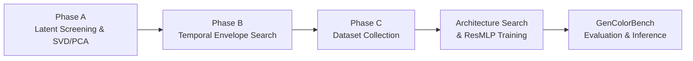

# Latent Color Subspace Control for Stable Diffusion XL (SDXL)

This directory contains the full implementation of the **training-free Latent Color Subspace Control** method adapted specifically for **Stable Diffusion XL** (`stabilityai/stable-diffusion-xl-base-1.0`).

---

## 🔬 Core Methodology & Pipeline Overview



### Architectural Specifics: SDXL vs. Other Architectures
| Component | FLUX.1 / FLUX.2 | SD 3.5 Medium | PixArt-Alpha/Sigma | Stable Diffusion XL (SDXL) |
| :--- | :--- | :--- | :--- | :--- |
| **Latent Channels ($C$)** | 16 / 32 | 16 | 4 | **4 channels** |
| **VAE Compression** | $8\times$ downsampling | $8\times$ downsampling | $8\times$ downsampling | **$8\times$ downsampling** ($1024\times 1024 \to 128\times 128$) |
| **VAE Scaling & Shift** | scale + shift | `scaling_factor = 1.5305`, `shift = 0.0609` | `scaling_factor = 0.18215` | **`scaling_factor = 0.13025`**, `shift = 0.0` |
| **Latent Representation** | 2x2 Patch Packed | Standard 4D $(B, 16, H, W)$ | Standard 4D $(B, 4, H, W)$ | **Standard 4D $(B, 4, H, W)$** |
| **Scheduler** | Flow Matching (Euler) | FlowMatchEuler ($v$-prediction) | DPM-Solver / Euler | **EulerDiscreteScheduler ($\epsilon$-prediction)** |
| **Text Encoders** | CLIP-L + T5-XXL | CLIP-L + OpenCLIP-bigG + T5 | T5-XXL | **CLIP-L + OpenCLIP-bigG** |

---

## 📁 Repository Structure

- [`sdxl_core.py`](file:///home/jsantamaria/projects/Color_Subspace_local/SDXL/sdxl_core.py): Low-level core engine for SDXL (model loader, 4D latent steering, temporal envelopes, multi-GPU subprocess orchestration).
- [`utils.py`](file:///home/jsantamaria/projects/Color_Subspace_local/SDXL/utils.py): SAM-3 instance segmentation, sRGB $\leftrightarrow$ CIELAB colorimetry, robust dominant color extraction (PCA + MAD z-score trimming), and exact CIEDE2000 metric.
- [`iscc_nbs.py`](file:///home/jsantamaria/projects/Color_Subspace_local/SDXL/iscc_nbs.py): ISCC-NBS Level 1 (13 centroids) and Level 2 (29 categories) color dictionary & matcher.
- [`model_pca.py`](file:///home/jsantamaria/projects/Color_Subspace_local/SDXL/model_pca.py): 15D continuous color featurizer and `ResMLP_256` inference wrapper.
- [`fase_a_pca.py`](file:///home/jsantamaria/projects/Color_Subspace_local/SDXL/fase_a_pca.py): **Phase A**: Latent Sensitivity Screening across 4 channels, SVD/PCA decomposition, scree plot, and perceptual cosine alignment ($\mathbf{U}_1 \leftrightarrow L^*, \mathbf{U}_2 \leftrightarrow a^*, \mathbf{U}_3 \leftrightarrow b^*$).
- [`fase_b_config_pca.py`](file:///home/jsantamaria/projects/Color_Subspace_local/SDXL/fase_b_config_pca.py): **Phase B**: Temporal schedule $w(t)$ optimization across `gate_frac`, `n_partes`, and profile envelopes.
- [`experiment_dense_magnitude_curve.py`](file:///home/jsantamaria/projects/Color_Subspace_local/SDXL/experiment_dense_magnitude_curve.py): Dense magnitude calibration curve & saturation sweep.
- [`coleccion_datos_mlp_pca.py`](file:///home/jsantamaria/projects/Color_Subspace_local/SDXL/coleccion_datos_mlp_pca.py): **Phase C Data Collection**: Multi-axial 3D spherical sampling in PCA space across 100 diverse scenes and dual-zone magnitude distribution.
- [`train_and_search_mlp_pca.py`](file:///home/jsantamaria/projects/Color_Subspace_local/SDXL/train_and_search_mlp_pca.py): Model architecture search and training on the collected dataset.
- [`val_mlp_shift_pca.py`](file:///home/jsantamaria/projects/Color_Subspace_local/SDXL/val_mlp_shift_pca.py): Closed-loop quantitative and qualitative validation on unseen prompts/colors.
- [`run_gencolorbench_pca.py`](file:///home/jsantamaria/projects/Color_Subspace_local/SDXL/run_gencolorbench_pca.py): Automated GenColorBench evaluation harness.
- [`generate_clean_plot.py`](file:///home/jsantamaria/projects/Color_Subspace_local/SDXL/generate_clean_plot.py): Publication-ready diagnostic plots.
- [`run_sdxl_pipeline_queue.py`](file:///home/jsantamaria/projects/Color_Subspace_local/SDXL/run_sdxl_pipeline_queue.py): End-to-end continuous pipeline runner.

---

## 🚀 Execution Guide

### Recommended Conda Environment
Use the verified `diffusion_2` environment (PyTorch 2.11+, Diffusers 0.39+, Transformers 5.15+):
```bash
conda activate diffusion_2
```

### 1. Phase A: Extract Latent Color Subspace
```bash
python fase_a_pca.py --out-dir ./fase_a_pca_out --parallel --gpus 1,2,3,4
```
*Outputs: `fase_a_pca_out/pca_axes.json`, `fase_a_pca_summary.png`, `fase_a_raw.csv`*

### 2. Phase B: Optimize Temporal Schedule
```bash
python fase_b_config_pca.py --out-dir ./fase_b_pca_out --parallel --gpus 1,2,3,4
```
*Outputs: `fase_b_pca_out/fase_b_winning_schedule.json`*

### 3. Phase C: Dataset Collection & MLP Training
```bash
# 3.1 Collect dataset
python coleccion_datos_mlp_pca.py --out-dir ./coleccion_datos_mlp_pca_out --n-baselines 3125 --parallel --gpus 1,2,3,4

# 3.2 Train MLP
python train_and_search_mlp_pca.py --dataset-path ./coleccion_datos_mlp_pca_out/dataset_mlp_pca_sdxl.csv --out-dir ./mlp_training_out --epochs 80 --gpu 1
```

### 4. Closed-Loop Validation & GenColorBench Evaluation
```bash
# Validate on test cases
python val_mlp_shift_pca.py --ckpt-path ./mlp_training_out/mlp_shift_pca_best.pt --out-dir ./val_mlp_shift_pca_out --gpu 1

# Run GenColorBench
python run_gencolorbench_pca.py --benchmark-csv /path/to/benchmark.csv --ckpt-path ./mlp_training_out/mlp_shift_pca_best.pt --out-dir ./gencolorbench_sdxl_out --gpu 1
```
