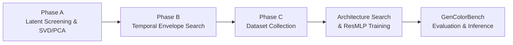

# Latent Color Subspace Control for Stable Diffusion 3.5 Medium (SD3.5-M)

This directory contains the full implementation of the **training-free Latent Color Subspace Control** method adapted specifically for **Stable Diffusion 3.5 Medium** (`stabilityai/stable-diffusion-3.5-medium`).

---

## 🔬 Core Methodology & Pipeline Overview



### 1. Architectural Specifics: SD3.5-M vs. FLUX
| Component | FLUX.1 / FLUX.2 | Stable Diffusion 3.5 Medium (SD3.5-M) |
| :--- | :--- | :--- |
| **Latent Channels ($C$)** | 16 (FLUX.1) / 32 (FLUX.2) | **16 channels** |
| **VAE Compression** | $8\times$ spatial downsampling | **$8\times$ spatial downsampling** ($1024\times 1024 \to 128\times 128$) |
| **VAE Scaling & Shift** | `scaling_factor` + `shift_factor` | **`scaling_factor = 1.5305`**, **`shift_factor = 0.0609`** |
| **Latent Representation** | 2x2 Patch Packed $(B, HW/4, 4C)$ | **Standard 4D Latent Tensor** $(B, C, H_{\text{lat}}, W_{\text{lat}})$ |
| **Scheduler** | Flow Matching (Euler) | **FlowMatchEulerDiscreteScheduler** ($v$-prediction) |
| **Text Encoders** | CLIP-L + T5-XXL | **CLIP-L + OpenCLIP-bigG + T5-XXL** |

---

## 📁 Repository Structure

- [`inference.py`](inference.py): Standalone downstream targeted object color steering for arbitrary prompts.
- [`sd35_core.py`](sd35_core.py): Low-level core engine for SD 3.5 Medium (model loader, 4D latent steering, temporal envelopes, multi-GPU subprocess orchestration).
- [`utils.py`](utils.py): SAM-3 instance segmentation, sRGB $\leftrightarrow$ CIELAB colorimetry, robust dominant color extraction (PCA + MAD z-score trimming), and exact CIEDE2000 metric.
- [`iscc_nbs.py`](iscc_nbs.py): ISCC-NBS Level 1 (13 centroids) and Level 2 (29 categories) color dictionary & matcher.
- [`model_pca.py`](model_pca.py): 15D continuous color featurizer and `ResMLP_256` inference wrapper.
- [`fase_a_pca.py`](fase_a_pca.py): **Phase A**: Latent Sensitivity Screening, SVD/PCA decomposition, scree plot, and perceptual cosine alignment ($\mathbf{U}_1 \leftrightarrow L^*, \mathbf{U}_2 \leftrightarrow a^*, \mathbf{U}_3 \leftrightarrow b^*$).
- [`fase_b_config_pca.py`](fase_b_config_pca.py): **Phase B**: Temporal schedule $w(t)$ optimization across `gate_frac`, `n_partes`, and profile envelopes.
- [`coleccion_datos_mlp_pca.py`](coleccion_datos_mlp_pca.py): **Phase C Data Collection**: Multi-axial 3D spherical sampling in PCA space across 100 diverse scenes and dual-zone magnitude distribution.
- [`train_and_search_mlp_pca.py`](train_and_search_mlp_pca.py): Model architecture search and training on the collected dataset.
- [`run_gencolorbench_pca.py`](run_gencolorbench_pca.py): Automated GenColorBench evaluation harness.

---

## 🚀 Inference Quickstart

Run closed-loop object color steering with an arbitrary prompt and target color:

```bash
python inference.py \
    --prompt "a photo of a ceramic mug on a table" \
    --target-color "#7B3F00" \
    --object "mug" \
    --device "cuda:0"
```
